# MERN Stack eCommerce App with Admin Dashboard and React Native App

An advanced eCommerce platform built with the MERN stack, featuring a powerful admin dashboard for managing products, orders, and users, along with a React Native mobile app for a seamless shopping experience.

## 🌐 Live Web App Demo

Check out the live version of the application here:

[👉 Live Web Link: juttapasal-26nz.onrender.com](https://juttapasal-26nz.onrender.com)

## 📝 Table of Contents

- [Description](#-description)
- [Features](#-features)
- [Tech Stack](#-tech-stack)
- [Screenshots and Demo](#-screenshots-and-demo)
- [License](#-license)
- [Contact](#-contact)

## 📜 Description

This project is a comprehensive eCommerce platform built using the MERN stack, featuring both a web application for customer interactions and an admin dashboard for product, order, and user management. Additionally, a React Native mobile app extends the shopping experience to mobile devices, providing users with a seamless and responsive interface for browsing and purchasing products.

## 🌟 Features

- **User Authentication:** Secure and robust authentication system using JWT, Firebase, and Google OAuth.
- **Admin Dashboard:** Manage products, orders, and users with a dynamic and responsive interface built with React and Tailwind CSS.
- **Product Search and Filters:** Easily search for products by name, brand, or discount.
- **Responsive Design:** Optimized for desktop and mobile viewing.
- **Wishlist and Cart Management:** Add items to the wishlist and cart with real-time updates.
- **Order Tracking:** Track orders from creation to delivery.
- **Analytics and Reporting:** View top products, revenue insights, and user statistics in the admin panel.

## 🛠 Tech Stack

- **Frontend:** React.js, Tailwind CSS, Redux Toolkit
- **Backend:** Node.js, Express.js
- **Database:** MongoDB
- **Mobile App:** React Native, Expo
- **Authentication:** JWT, Firebase, Google OAuth
- **API Calls:** Axios, React Query
- **State Management:** Redux Toolkit, Redux Persist
- **Styling:** Tailwind CSS, NativeWind for React Native
- **Deployment:** Render (Web), Expo (Mobile)

## 📸 Screenshots and Demo
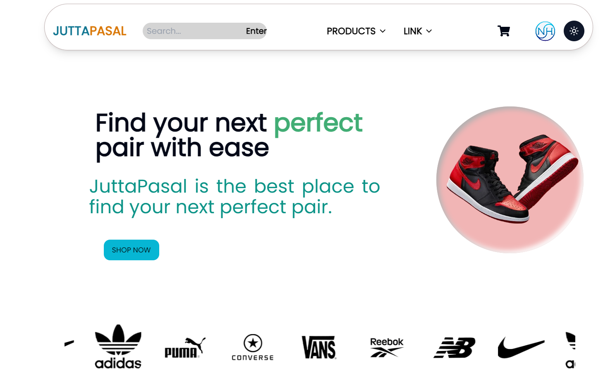
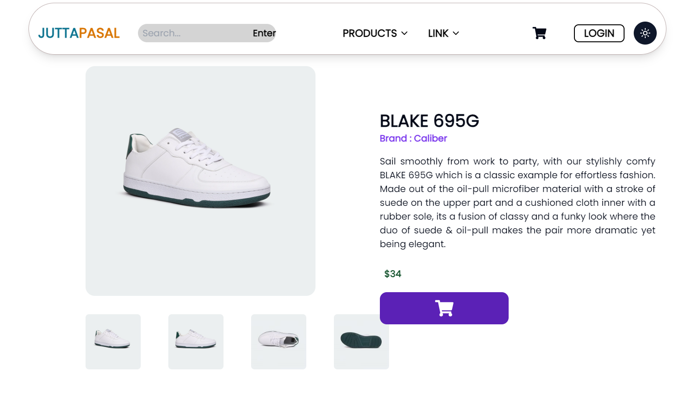
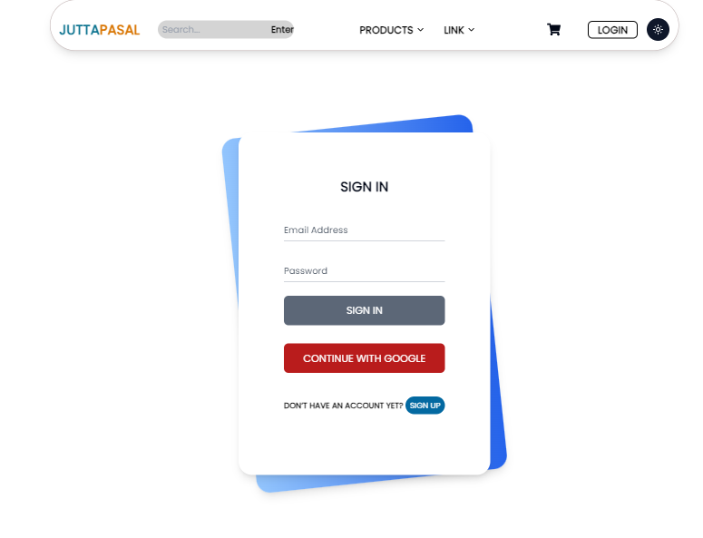
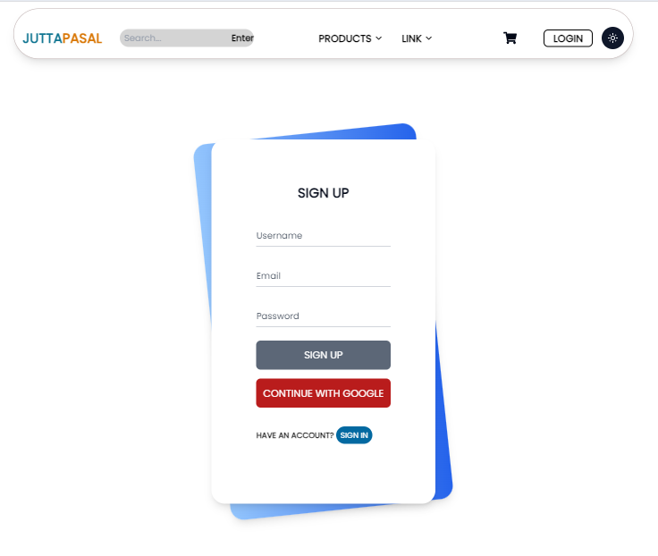
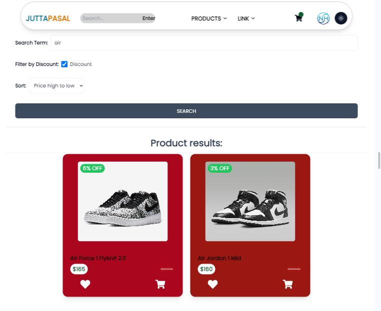
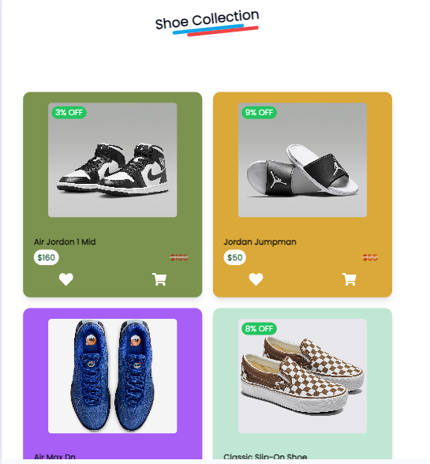
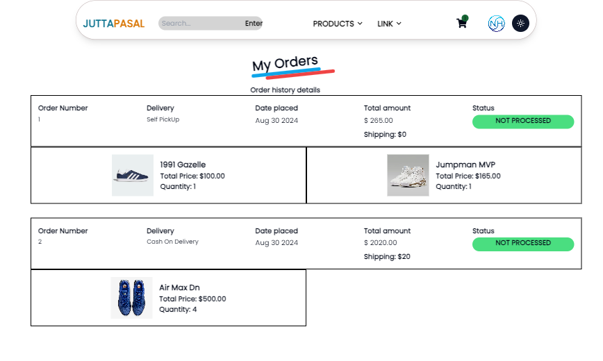
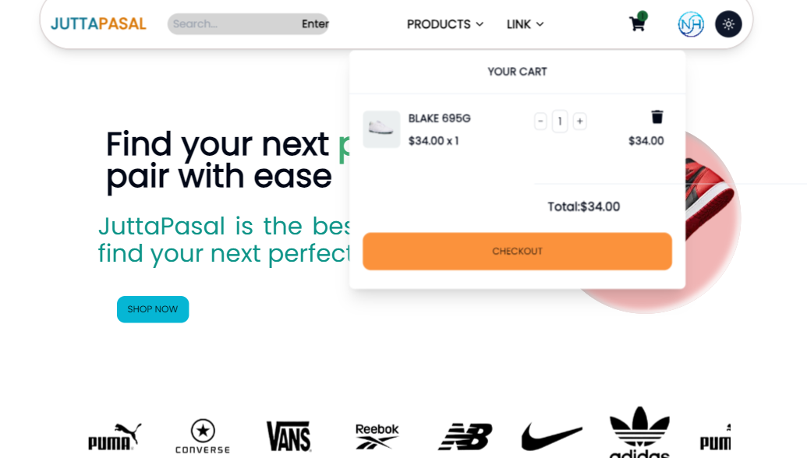
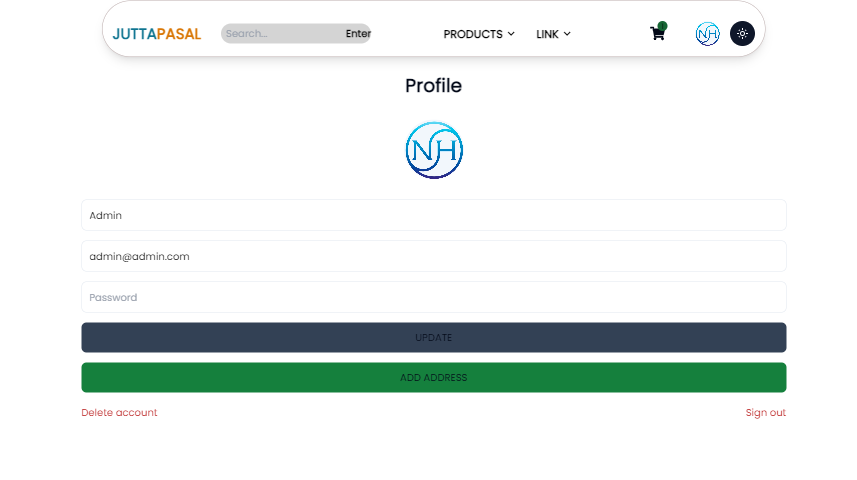

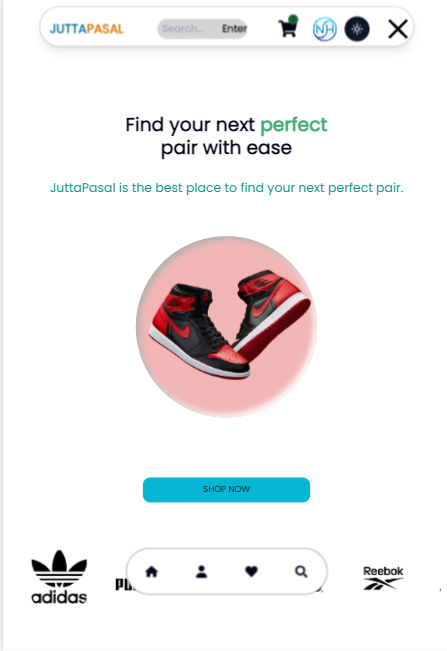

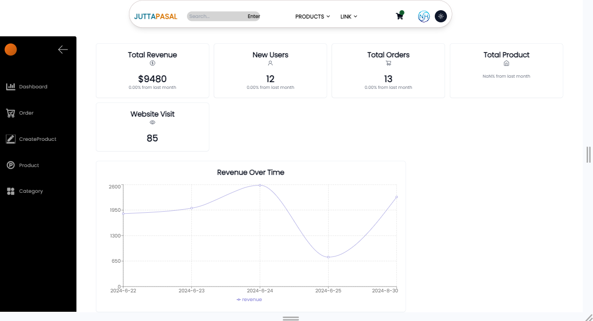
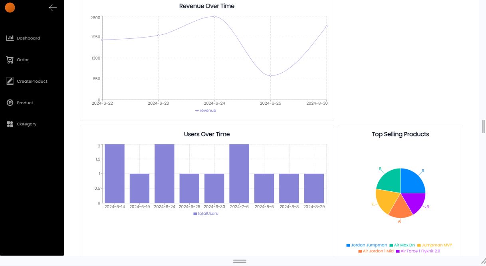
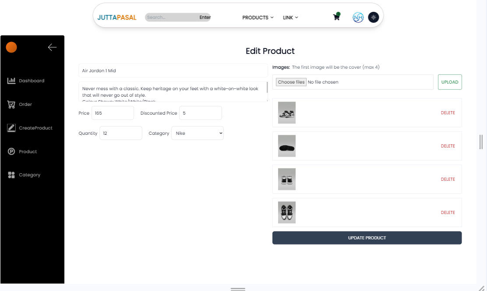
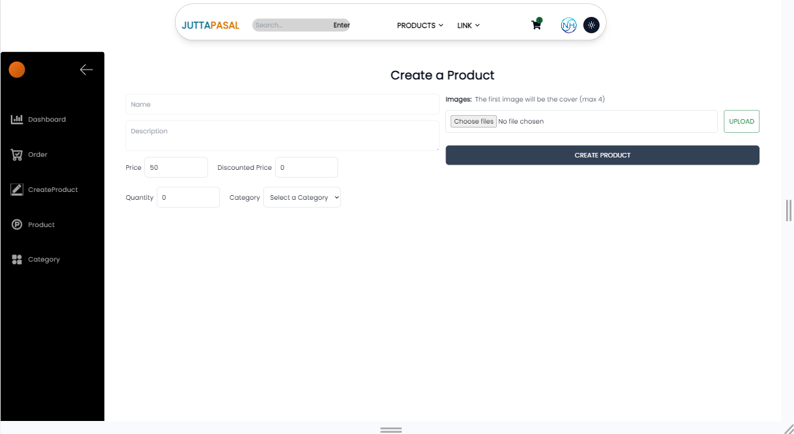
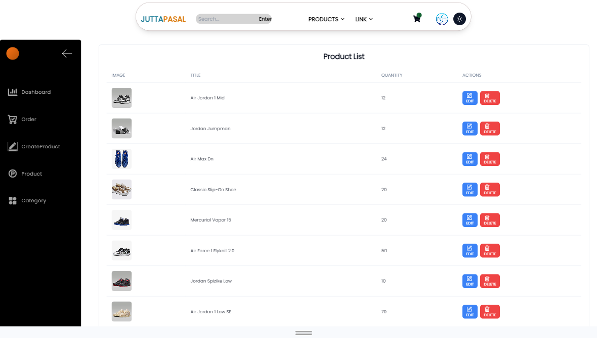

## 🎥 Mobile App Demo Video
[

## 📄 License

This project is licensed under the MIT License - see the [LICENSE](LICENSE) file for details.

## 📧 Contact

For any inquiries or support, please reach out to:

- **Name:** Nabin Hamal
- **Email:** [nabinhamal2@gmail.com](mailto:nabinhamal2@gmail.com)
- **GitHub:** [github.com/nabinhamal](https://github.com/nabinhamal)
